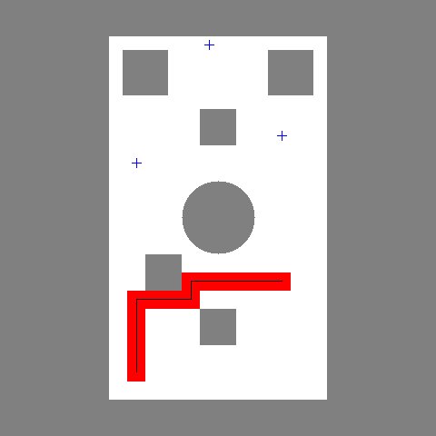

## Question 2

### a. 

We have chosen a holonomic drive system, such as Mecanum wheels. The rationale is that a holonomic system allows the robot to move in any direction without altering its orientation, which is unachievable with a non-holonomic system. This capability ensures that the vacuum system remains consistently positioned at the rear of the robot.

The configuration space is defined as the space that describes all possible states of the robot, where each point represents a unique state of the robot. Mathematically, the configuration is represented as q=(x,y,θ).

### b. 

We employ Dijkstra's algorithm to compute paths sequentially based on the order of points. A graph is constructed where the nodes represent the grid points of the map, and the edge weights correspond to the distances between two points. By running Dijkstra's algorithm, obstacles and no-go zones are effectively avoided. The pictures are shown below.

If the ordering did not matter, the path sequence would change to: start - 2 - 3 - 4 - 1 - finish. The reason is that at each step, the algorithm searches for the nearest point from the current position, which may lead to being trapped in a local optimum.

### c.

In this case, we choose a fifth-order polynomial function. The reason is that a fifth-order function ensures that the boundary conditions, specifically velocity and acceleration, are zero when the robot reaches the desired points. This guarantees global smoothness in position, velocity, and acceleration.

### d.

We use a holonomic drive system, such as Mecanum wheels, to ensure that the robot does not experience angular deviation during movement. The robot's motion is purely translational, which prevents water from being missed due to rotation or turning.

### e.

Here is a simple approach: First, generate a grid map. Next, plan the path using a serpentine pattern, sweeping in a "Z" shape row by row or column by column, starting from the origin. Then, integrate global and local obstacle avoidance. Finally, optimize and smooth the path.